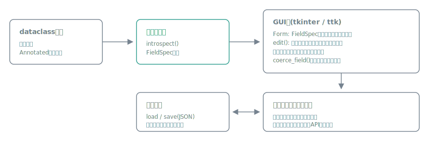

# katachi

[](https://github.com/miruky/katachi/actions/workflows/ci.yml)
[](https://www.python.org/)
[](https://docs.pytest.org/)
[](https://docs.astral.sh/ruff/)
[](https://opensource.org/licenses/MIT)

**dataclassと型ヒントを書くだけで、検証つきの設定画面を生成する依存ゼロの宣言型GUIライブラリです。**

## 概要

Pythonの小さなツールに設定画面を付けたいとき、現実的な選択肢はtkinterを手書きするか、WebベースのGUIフレームワークを丸ごと持ち込むかの両極端になりがちです。katachiはその中間を埋めます。すでに書いているdataclassに`Annotated`のメタデータを足すだけで、ウィジェットの選択、入力検証、JSONへの保存と復元までを1関数で済ませます。バックエンドは標準ライブラリのtkinterなので、実行時の追加依存はありません。

```python
from dataclasses import dataclass
from typing import Annotated
import katachi
from katachi import Help, Range

@dataclass
class Settings:
    workers: Annotated[int, Range(1, 32), Help("並列処理の上限")] = 4
    verbose: bool = False

settings = katachi.edit(Settings, store="~/.config/myapp/settings.json")
```

これだけで、スピンボックスとチェックボックスを持つダイアログが開き、保存ボタンで検証済みの`Settings`インスタンスが返ります。`store`を渡していれば前回の値の読み込みと保存も自動です。

### なぜ作ったのか

社内ツールやCLIに「ちゃんとした設定画面」を付けるコストが高すぎる、という問題意識から作りました。FletやTogaのような汎用GUIフレームワークはアプリ全体の構造を自分の流儀に合わせることを要求しますが、欲しいのが設定画面だけなら過剰です。katachiは設定画面ジェネレータに役割を絞ることで、宣言型の体験を小さなAPIで成立させています。

## 使い方

### 対応する型とウィジェット

| 型 | ウィジェット |
|:--|:--|
| `bool` | チェックボックス |
| `int` / `float` | スピンボックス(`Range`で範囲指定) |
| `str` | 1行入力(`Multiline`でテキストエリア、`Secret`で伏せ字) |
| `Enum` / `Literal` / `Choices` | ドロップダウン |
| `Path` | パス入力+参照ボタン(`FilePath` / `DirPath`) |
| `list[str]` | 追加・削除つきリスト |
| ネストしたdataclass | 枠つきのグループ |

### マーカー一覧

| マーカー | 役割 |
|:--|:--|
| `Range(min, max, step=None)` | 数値の範囲と増分 |
| `Choices(*values)` | strとintの選択肢 |
| `Label(text)` | 表示ラベル(未指定はフィールド名から導出) |
| `Help(text)` | フィールド下の補足説明 |
| `Multiline(height=5)` | 複数行テキスト |
| `Secret()` | 伏せ字入力 |
| `FilePath(patterns=())` | ファイル選択ダイアログ |
| `DirPath()` | ディレクトリ選択ダイアログ |

### フォームを既存ウィンドウに埋め込む

```python
from katachi.tk import Form

form = Form(parent, Settings, on_change=lambda: print("変更された"))
form.pack(fill="both", expand=True)

instance = form.get()   # 不正入力ならFormValidationError、各欄に赤字でも表示
form.set(instance)      # インスタンスを流し込む
```

### GUIなしで使う

スキーマ解析・検証・永続化はtkinterと独立しているので、ヘッドレス環境でもそのまま使えます。

```python
from katachi import introspect, load, save

spec = introspect(Settings)            # FieldSpecの木
settings = load(Settings, "~/.config/myapp/settings.json")  # なければデフォルト
save(settings, "~/.config/myapp/settings.json")
```

設定ファイルは人が読めるJSONで、フィールドの増減に強い仕様です。知らないキーは無視し、欠けたキーはデフォルト値で埋めるため、アプリのバージョンを跨いでも壊れません。

## アーキテクチャ



スキーマ層(introspect)・検証層(coerce)・永続化層(JSON)は純粋なPythonで、tkinterに触れません。GUI層はFieldSpecの木を機械的にウィジェットへ写すだけの薄い層です。この分離により、ロジックの大半をディスプレイなしでテストできます(CIではxvfb上で実ウィジェットの往復テストも行います)。

## 技術スタック

| カテゴリ | 技術 |
|:--|:--|
| 言語 | Python 3.12+ |
| GUI | tkinter / ttk(標準ライブラリ) |
| 永続化 | JSON(標準ライブラリ) |
| 実行時依存 | なし |
| テスト | pytest(GUIテストはxvfb) |
| リンタ | Ruff |
| CI | GitHub Actions |
| パッケージング | hatchling |

## プロジェクト構成

- `katachi/schema.py` — dataclassをFieldSpecの木に変換するイントロスペクション
- `katachi/markers.py` — `Range`や`Help`などのAnnotatedメタデータ
- `katachi/validation.py` — 生入力の型変換と検証
- `katachi/persistence.py` — JSONとの相互変換、load / save
- `katachi/tk/` — tkinterバックエンド(Form、editダイアログ)
- `tests/` — ヘッドレステストと実ウィジェットの往復テスト
- `examples/settings_demo.py` — 一通りの機能を使うデモ

## はじめ方

### 前提条件

- Python 3.12以上(tkinter同梱のビルド)

### セットアップ

```bash
git clone https://github.com/miruky/katachi.git
cd katachi
make install
```

### デモの実行

```bash
python examples/settings_demo.py
```

### テストの実行

```bash
make test
```

### Lintの実行

```bash
make lint
```

## 設計方針

- **依存ゼロ** — 実行時依存を持たない。pip installできない環境でもファイルコピーで動く
- **スキーマとGUIの分離** — イントロスペクション・検証・永続化はtkinter非依存で、ヘッドレスでテストできる
- **後方互換な設定ファイル** — 知らないキーは無視、欠損キーはデフォルト値。フィールドの増減でファイルが壊れない
- **Enumはnameで保存** — valueは型が揺れるため、一意で必ず文字列になるnameをJSONに書く
- **デフォルト値の強制** — 全フィールドにデフォルトを要求し、「ファイルがなくても起動する」ことを型レベルで保証する

## 制約

`Optional`型、`dict`、ネストしたリスト、日付型には現バージョンでは対応していません。また、テーマのカスタマイズはttkの既定スタイルに従います。これらはロードマップとして扱います。

## ライセンス

[MIT](LICENSE)
